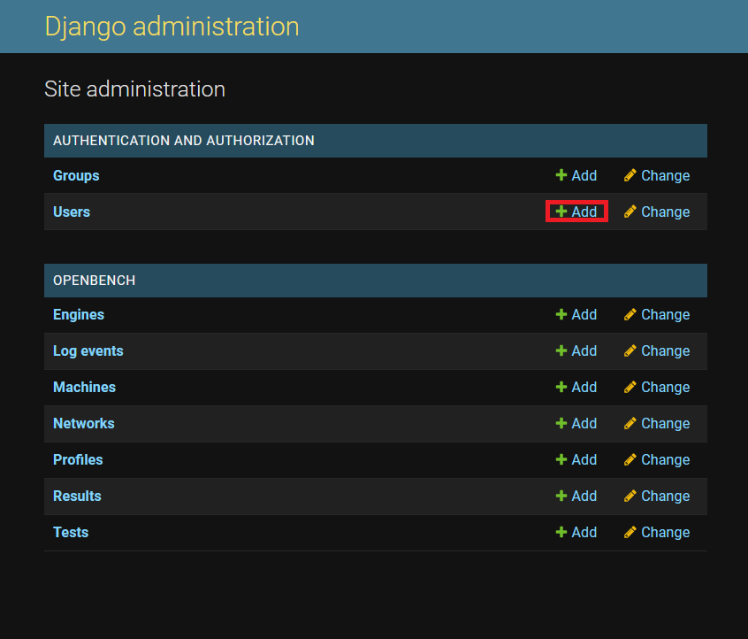
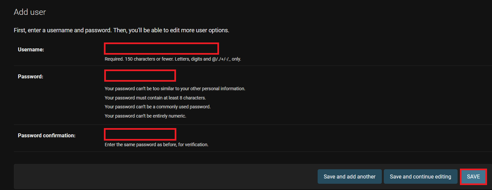
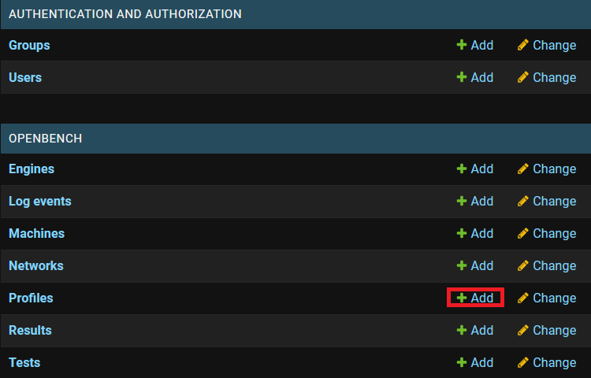
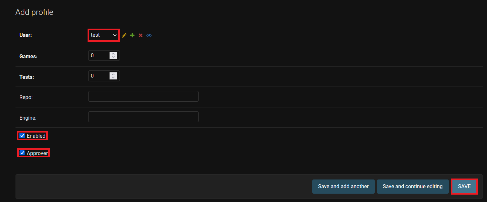

# Guide to setup our own OpenBench Instance

## Installing the repository

First, you will need to clone the OpenBench repository and create a new Python environment to run it in. Assuming you already have a Python3.x installation (tested with 3.10) and the environment manager of your choice, here I will use venv for its simplicity: 

```
git clone https://github.com/AndyGrant/OpenBench.git # cloning the repo
cd OpenBench
python -m venv env # creating a local python env named env
source ./env/Scripts/activate (linux) | ./env/Scripts/activate.bat (Windows CMD) | ./env/Scripts/Activate.ps1 (Windows PowerShell) # activate the env
pip install -r requirements.txt
```

## Launching OpenBench Instance

For the first launch, you need to make some settings first:

```
python manage.py makemigrations
python manage.py migrate
python manage.py migrate --run-syncdb
python manage.py createsuperuser
```

Then, to start the server locally, the command would be as follows:

```
python manage.py runserver 127.0.0.1:8000
```

## Modifying the config to add your engine to OpenBench

Navigate to `OpenBench/config.py`, the last field in the `OPENBENCH_CONFIG` dict is ``engines``. Assuming you only need your own engine for this instance of OpenBench, you can delete all the entries to leave only yours. The format should be as follows:

```
'engines' : {

        '<Engine Name>' : {

            'nps'    : <Nodes per second>,
            'base'   : '<Base branch name (often main or master)>',
            'bounds' : '[0.00, 5.00]',
            'source' : '<Github URL to your repo (without .git at the end e.g. https://github.com/official-stockfish/Stockfish)>',

            'build' : {
                'path'      : '<Path to the Make file of your engine (often src)>',
                'compilers' : ['<Compiler used for your engine (e.g. g++ or gcc for C++/C)>'],
                'cpuflags'  : ['<Flag for the compilation>'],
            },

            'testmodes' : [
                {<Any test mode that you want, STC and LTC are just some examples>},
                { 'id' : 'STC',                'th' : 1, 'hash' :   8, 'tc' : '8.0+0.08' },
                { 'id' : 'LTC',                'th' : 1, 'hash' :  64, 'tc' : '40.0+0.4' },
            ],
        },
    },
```

## Creating a standard user

Start your OpenBench instance:

```
python manage.py runserver 127.0.0.1:8000
```

Navigate to the admin panel at `127.0.0.1:8000/admin` and login with the previously created superuser if you are not already logged in.

Here we will add a new user:



Fill in the different fields and click on save:



Once the new user is created, go back to the main administration page (`127.0.0.1:8000/admin`). And create a new profile.



Select the user you just created and check both the `enabled` and `approver` fields then click save.



## Creating a new test

To create a new test, return to the main OpenBench hub (`127.0.0.1:8000`). You will need to log in with the newly created account, your superuser should only be used for the administration section.

While logged in, click and create a new test, in the engine field you should see the engines you added in the `OpenBench/config.py` file. Select it and then you should be able to choose from the different test modes you specified in the corresponding field of the `OpenBench/config.py` file, in my example it should be (STC and LTC). The different fields will be autocompleted. Then the remaining fields to fill in should be `Source`, `Dev Bench`, `Dev Branch`, `Base Bench` and `Book`.

- __Source__ : Must be the Github URL of your repo (e.g. https://github.com/official-stockfish/Stockfish).
- __Dev Branch__ : Branch of your Github repo that you want to test against main
- __Dev Bench__ : Number of nodes traversed by your engine after running a bench run on the dev branch.
- __Base Bench__ : Number of nodes traversed by your engine after running a bench run on the main branch.
- __Book__ : The opening book used for the games.

After filling in all the fields, you should be able to create a new test, you should see your newly created test appear, you can click on it to get various information.

## Running the Client

The OpenBench Client is a python script. The Client needs access to make and gcc. Make is used to initiate builds for engines. Every engine on the framework will have a makefile in its repository. That makefile will execute a compiler, which is configured via OpenBench. When the Client is run, it will first check for compilers against the list of compilers requested by the engines on the framework. gcc is needed though, even if no C engines are on the framework, in order to determine CPU flags like POPCNT, AVX, AVX2, and more. For Windows users, a POSIX version of gcc is recommended.

The client takes four arguments: Username, Password, Server, Threads. Threads tells the Client how many games can be run in parallel. This should be no more than your CPU count.

The client will create an Engines, Books, Networks, and PGNs directory. These are used to store compiled engines, downloaded opening books, downloaded Networks, and PGNs of the games played. By default, Engines and PGNs are deleted after 24 hrs. Networks are deleted after a month. These durations can be changed directly in the Client in cleanup_client()

To create a new client, you will need to run the `Client/Client.py` file.

```
python ./Client/Client.py -U <username> -P <password> -S <URL to Openbench Instance (e.g. http://127.0.0.1:8000)> -T <Number of threads>

```

If everything works, this should download the source code for your engine compile the main branch and the dev branch, run a bench run on each to compare with your inputs when you created the test, and then run the test.


For the bench run, the syntax should be `<engine executable> bench` and the executable should terminate after the run. The format for the number of nodes traversed and nodes per second should be `<x> nodes <y> nps` on a new line, with x being the number of nodes as an integer and y the nodes per second as an integer as well.
